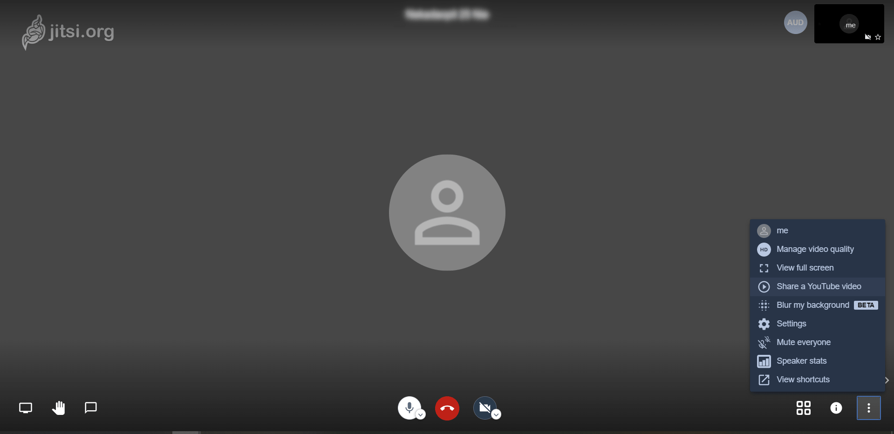

## Docker, Vidéo conférence et Jitsi

### Présentation

  Lors de cette SAé, nous avons appris les bases de Docker afin d'héberger différentes applications, tel que de la visoconférence. Nous nous sommes donc concentrer sur une application communicante et complexe telle que Jitsi.

### Docker 
  
    

  Docker permet d'éxecuter des applications dans des conteneurs, voici un peu de vocabulaire :
  
  - Serveur ( demon Docker ) : Il peut créer et gérer des images Docker
  - Interface de ligne de commande ( CLI ) : C'est un client qui sert à entrer des commandes pour Docker
  - Image : Fichier non modifiable qui contient l'ensemble des fichiers nécessaires à la création d'un conteneur
  - Conteneurs : Image en cours d'execution
  - Dockerfile : C'est un fichier qui contient l'ensemble des intructions, a effectuer pour créer une image
  - Volume : Répertoire  

Pour réaliser notre projet, nous avons créé un **Dockerfile**, qui une fois lancé, appliquera une suite de commande.  

Nous avons aussi le fichier **automatic-jitsi-answers** qui répond automatiquement aux éventuels questions que peux poser Jitsi au cours de son installation.  

Nous avons un **README** qui, une fois lu, permet d'adapter certains bout de fichier aux besoins de l'utilisateurs avant la création de l'image et du conteneur.  

Et nous avons un script **startup.sh** qui permet de démarrer les différents services de Jitsi ainsi que Nginx ( serveur web ).

Nous nous intéresserons principalement au **Dockerfile**. Dans les premières commandes, nous prenons l'image Docker de Debian et nous mettons à jour le système, et installons les paquets nécessaires pour Jitsi.  

Ensuite nous ajoutons une dépendance de Jitsi, du nom de Prosody. Et en plus d'ajouter le dépôt contenant Prosody, on ajoute celui de Jitsi. Puis nous mettons à jour l'ensemble des dépôts du système.  

Ensuite nous copions notre fichier **automatic-jitsi-answers** et nous enregistrons les réponses aux questions que nous pose Jitsi, lors de la commande suivante, celle de son installation.  

On expose les ports nécessaires pour l'ensembles des communications avec Jitsi.  

On supprime ensuite le fichier de configuration par défaut de NGinx  

Nous copions ensuite notre script shell **startup.sh**, nous le rendons exécutable afin qu'il soit lancé lors de la création du containeur.  

### Jitsi
 
La visioconférence ou vidéo conférence est utile pour le télétravail et s’est popularisé avec la COVID-19. Pour notre projet, nous avons opté pour de la visioconférence, car nous avons voulu un projet original, utile et assez complexe pour travailler.

Durant nos recherches, nous sommes tombés sur plusieurs applications open source, de visioconférences tels que :

-	Apache OpenMeeting
-	Element 
-	Jami
-	Jitsi

Nous avons choisi Jitsi pour son interface, car c'est l'une des rares application gratuite, open source et auto hébergé. Nous avons donc décidé de le choisir pour notre projet.

Voici une représentation de l'interface Jitsi  

             

### GitHub Pages

GitHub pages est un outil permettant de créer un site internet de manière plus simple que du HTML/CSS/JS afin de présenter un projet. On a le choix parmi plusieurs template ( modèles ) qui vont nous servir de base comme squelette du site internet.

Le HTML version GitHub ( Markdown ), se créer avec des balises qui ont des formes différentes. Notamment en mettant des mots entre certains caractères comme des dièses, apostrophe, etc. Qui permettent de mettre en forme le texte de la manière qu’on le souhaite. 

### Conclusion

Grâce à ce projet, nous avons pu découvrir l’utilité et le fonctionnement de Docker en passant par le terminal ou bien par Docker for Desktop. Nous avons réussi à héberger un logiciel de visioconférence de manière stable. Et nous nous sommes organisés afin de travailler en équipe efficacement.  

Malheureusement nous n'avons pas pu exploiter notre projet sur Windows a cause de la copie du fichier **startup.sh**, qui n'arrive pas à se copier dans le dossier /root.
