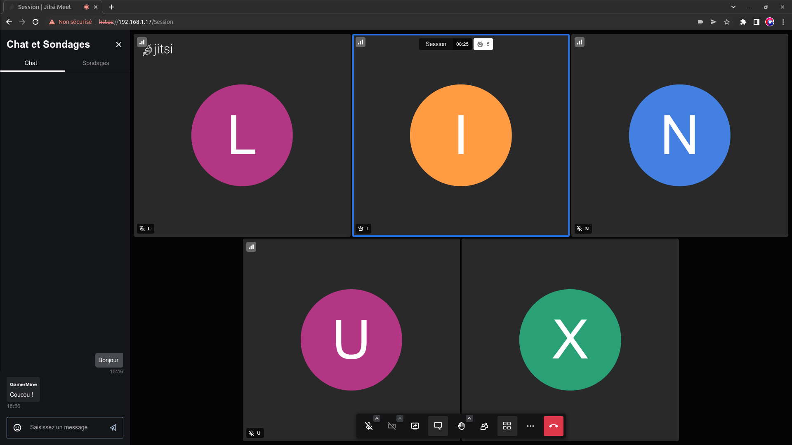

## Saé 2.03

### Docker, Vidéo conférence et Jitsi

### Présentation

  Lors de cette Saé, nous avons appris à mettre en place un service réseau à l'aide de Docker pour répondre aux besoins d'un client. Nous nous sommes donc concentrer une application communicante et complexe telle que Jitsi qui permet de réaliser des vidéoconférence. 

### Docker 
  
  Le docker permet d'éxecuter des applications dans des conteneurs
 
       >Architecture 
  
  -> Serveur ( demon docker ) : Il peut créer et gérer des images de docker
  
  -> API de Repos : Il indique au demon docker ce qu'il doit faire 
  
  -> Interface de ligne de commande ( CLI ) : C'est un client qui sert à entrer des commandes pour le docker
  
  
       >Conteneurs
  
       >Dockerfile
  
       >Volumes

  

### Jitsi
 
La visioconférence ou vidéo conférence est utile pour le télétravail et s’est popularisé avec la COVID-19.  Pour notre projet, nous avons opté pour de la visioconférence, car nous avons voulu un projet original, utile et assez complexe pour travailler.

Durant nos recherches, nous sommes tombés sur plusieurs applications open source, de visioconférences tels que :
-	Apache OpenMeeting
-	Element 
-	Jami
-	Jitsi.

Nous avons choisi Jitsi pour son interface, et car c'est l'une des rares application gratuite, open source et auto hébergé. Nous avons donc décidé de le choisir pour Docker

Voici une représentation de l'interface Jitsi        

             

### GitHub Pages

Pour ce projet, nous avons aussi dû apprendre à utilisé GitHub Page, une version simplifié de HTML/CSS.      

### **Conclusion**
